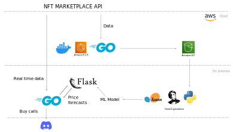

# What it is
It is a pipleine to to predict the price of nfts going on sale on the Ax1e 1nfinity marketplace. A ML model forescasts the nft price as soon as it is listed and sends a buy notification to Discord if the forecasted price is significantly above the price that it is being listed at. The idea is to flip the nfts in a short time frame, that is, buy them and sell for more in minutes/hours.

# How it works, tech choices, difficulties
image:

## Data collection
The ML model is trained with market data. To get the data from the market API, a docker container that runs a Go script is hosted on an ECS cluster. The container is run every 8 hours on a cron job, collecting data in json format for ~10 minutes and then and sending it to an S3 bucket. 

I looked into using AWS lambda for running the cron job but for this usecase this solution turns out to be cheaper. 

Also, I scraped from websites some data that was not directly available from the API. To do so I used selenium directly from my laptop. This Selenium code I copied from another repo and it is not included in this repo or diagram.

## Model training
To train the model, I download the data from S3 to my laptop and run a script that runs a training pipeline locally/on-premise. The pipeline starts by doing some data-validation/tests on the data using a library called Great Expectations, continues with some data cleansing and feature engineering using pandas and numpy and finally trains a few different models on scikit-learn using cross-validation and builds and ensemble model that I store locally.

For the data validation I also looked into other libraries, particularly Pydantic, but choose Great Expectations, which I had already used in a previous project and found simple enough to use for the usecase.

I also trained Tensorflow NeuralNets but found that the model.predict() was not fast enough for serving the model predictions for real time inference (the market is competitive and the buy signals don´t last long). So far I have heard enough praise for Pytorch vs Tensorflow so after this and also after having tried to use Tensorflow Extended unsuccesfully in a previous project, I would like to try Pytorch and possibly ditch Tensorflow for Pytorch if the circustances are right.

## Why I chose Golang

- Because I wanted to learn Go as it is a good language for infrastructure used by many companies. Docker (and Kubernetes) are written in Go. Go Docker containers are lightweight compared with Python Docker containers, which might come in handy for future projects . I also might do robotics in the future and I believe Go is useful for that.

- Because I wanted to do several API calls concurrently to the the market API, to be faster than my competitors and have an edge. I tried Python´s aiohttp library before that but I did not seem provide me with all the capabilities that I was looking for. The fact that some people joke that async code in Python is a nightmare also influenced decision. I did Go, and writing something like a worker pool was fun and easy, as it was learning Go. Negatives for me where that it can be a bit verbose.

In order to send concurrent requests to the API without getting flagged I used a proxy service to route my requests through proxies, but found that sending the requests through proxies could add from 10 to 30 seconds delay which was not suitable, so I discarded that and opted to make only a few concurrent requests from my IP. This way additional strain was not inflicted on the API.

## Model serving for Real Time inference and why I use Flask

Since I moved all my setup to get data from the API to Go, I wanted to be able to call the model predictions on the new incoming data from Go, but the model is for Python, so I had to find a way to communicate Python with Go. I suspect this is going to be a theme if you are going to do data science and Go in the same project: Because most of the data-science/ML resources are on Python (there´s also R and Julia), you are going to need a way to bridge the 2 worlds. The 2 main options I found where:

- Using cgo: https://www.datadoghq.com/blog/engineering/cgo-and-python/ . If i´m not mistaken it is an interface that takes advantage of the fact that Python ir written in C to bridge the 2. To use it you have to get into low level things like the GIL that you might not want to get into, as per the article that I just linked.

- Setting a localhost server to provide the microservices that you need in languages different from your main ones. For example, for me for real time inference my main language is Go because I only need Python to do the model.predict(), so in my case I set up a server using Flask that runs a short script that does model.predict() on the data coming from Go and returns the prediction back to Go. For this approach all of the articles that I read are about using the GRPC protocol instead of REST for communication between client and server. I believe GRPC is faster and more ligthweight than REST (but not as convenient) and this is what makes it more adecuate for setting up these kind of internal microservices.

However, for my simple usecase, since I already had some experience with REST and Flask, I decided, and was able to, quickly set up my localhost server with Flask and send the requests using REST. It worked perfectly fine.

# How long it took me and what i learnt

6 weeks. The main things that I go from this project that I had no previous experience in were Go and the AWS ecosystem. I also set up my first container. 
- For AWS I spent some time on https://acloudguru.com/ getting to know the AWS ecosystem and which of their services to use for this project.
- For Go I went through this quick intro called "A Tour of Go", which I recommend: https://go.dev/tour/welcome/1 ; from there I just skimmed through a couple books and everything else was just learning by doing and finding the way other people do things in places like Stack Overflow.

# Things that I left out

By the 6th week I was considering looking into Apache Airflow. I know that it is one of the most consolidated tech choices for Extract-Load-Transform (ETL) pipelines for data engineers right now, and so my idea was to find out whether I could use a DAG to automatize the model training part and maybe monitorize model performance based on earnings and retrain the model based on that.
I also considered throwing in an experiment tracking tool like MLFlow or Weights&Biases, to track different models as the market evolves, and maybe more importantly to track the data and do dataset versioning.
However last in the last 2 months I´ve been involved in blockchain hackathons and also began interviewing for jobs so I´ve paused this side project indefinetly. It was fun and served its purpose, to learn by doing.

# A bit about the nfts, how I got into this project, and additional difficulties

The nfts are from a popular "play to e4rn" game, called "Ax1e 1nfinity". I don´t play this game but I have some friends that do, and they hyped me about the amount of money flowing in and the bots predating the market. I thought that this could be fun and we could make some money while adding a bunch of new tehcnologies to my repertoire so I set up to do an ML pipeline to flip the nfts. What I found is that the Pokemon-counterbalance nature of the game and the meta changes make it so that in order to be able to invest or do feature engineering to make a model you have to understand the idosynchracies of the gameplay and indeed need to play the game. I did play briefly to understand the game better but I´m not into it, I think it´s a waste of time if you are a capable person of age. The models that I got do work but are not robust and often miss the mark hard and so I need a "human in the loop" to give the confirmation on the final trades in order to make money. I onboarded my friends onto a discord server where the buy notifications go and together we made a bit of money. However to focus on speculation is not the direction that I want to move in, so moving onto another things.

That´s it, I hope you found this interesting if you read through the whole thing.
